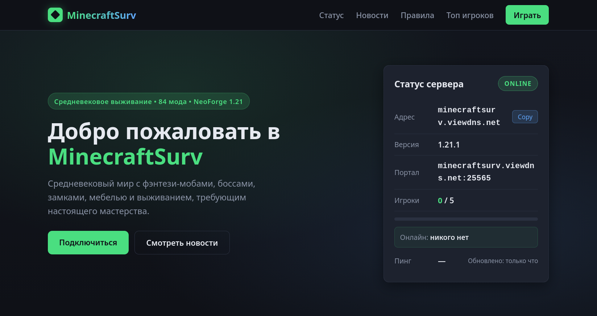
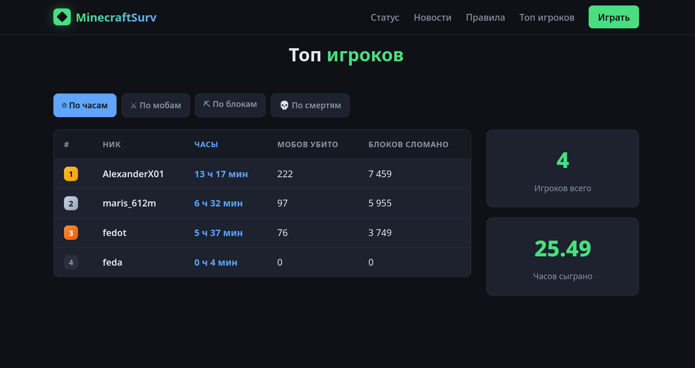
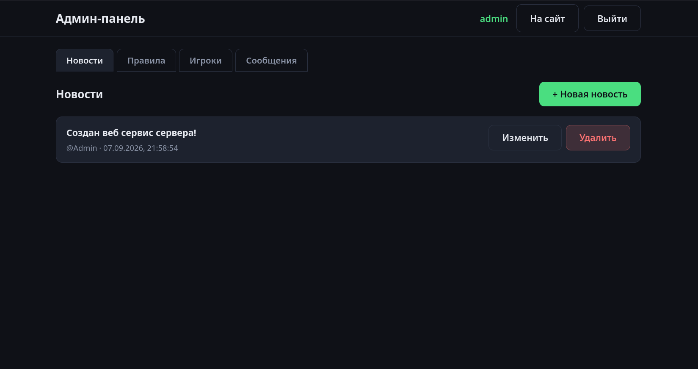

# MinecraftSurv — веб-платформа Minecraft-сервера

> Web platform for a Minecraft survival server: live server status, news feed, rules,
> players leaderboard with statistics, contact form and an admin panel with JWT auth.

Стек: **Node.js · Express · PostgreSQL · Sequelize (ORM) · RAW SQL · Docker · EJS**

## Возможности

- **Статус сервера в реальном времени** — фоновый опрос сервера каждую минуту: онлайн, игроки онлайн/макс., версия, пинг, история доступности за 7 дней.
- **Новости** — лента публикаций с модальным просмотром.
- **Правила** — структурированный список правил сервера.
- **Топ игроков** — позиции по наигранным часам, убийствам, сломанным блокам и смертям.
- **Статистика** — агрегированные показатели по всем игрокам.
- **Контактная форма** — сбор сообщений в БД.
- **Админ-панель** — CRUD новостей, правил, игроков и сообщений; JWT-аутентификация.
- **RAW SQL + ORM** — часть запросов (топ, история, статистика) выполнена на «сыром» SQL с JOIN, CRUD — через Sequelize.

## Скриншоты







## Технологии

| Слой | Инструменты |
|---|---|
| Backend | Node.js, Express, EJS (шаблоны), JSON Web Token |
| Данные | PostgreSQL, Sequelize ORM, SQL (raw queries) |
| Задачи | mcstatus-опрос в фоне (setInterval + сервис) |
| Инфраструктура | Docker, docker-compose (app + postgres) |

## Быстрый старт

```bash
# Полный запуск в Docker (PostgreSQL + приложение)
docker compose up --build -d

# Тестовые данные
docker compose exec app npm run seed

# Открыть
http://localhost:3000
```

Локальная разработка (только БД в Docker):

```bash
docker compose up -d postgres
npm install
npm run seed
npm run dev     # nodemon, автоперезагрузка
```

## Конфигурация

Настройки задаются через **`.env`** (файл не попадает в репозиторий). Сделайте копию шаблона `.env.example` с пустыми значениями и заполните свои:

```bash
cp .env.example .env
```

| Переменная | Назначение | По умолчанию |
|---|---|---|
| `PORT` | Порт веб-приложения | `3000` |
| `DB_HOST` | Хост PostgreSQL | `localhost` / `postgres` (Docker) |
| `DB_USER / DB_PASSWORD / DB_NAME` | Доступ к БД | — |
| `JWT_SECRET` | Секрет подписи токенов | — |
| `MC_HOST / MC_PORT` | Адрес Minecraft-сервера | `localhost:25565` |
| `CONTACT_EMAIL` | (опц.) email, показываемый на странице | `shelestovx01@gmail.com` |

## API

| Метод | Путь | Что делает |
|---|---|---|
| GET | `/api/status` | Текущий статус сервера |
| GET | `/api/status/history` | Онлайн за последние 7 дней (RAW SQL) |
| GET | `/api/news` | Все новости |
| GET | `/api/news/:id` | Одна новость |
| GET | `/api/rules` | Правила сервера |
| GET | `/api/players/top` | Топ игроков (RAW SQL JOIN) |
| GET | `/api/players/statistics` | Сводная статистика (RAW SQL) |
| GET | `/api/players` | Все игроки (ORM include) |
| POST | `/api/contact` | Отправить сообщение (RAW SQL INSERT) |
| GET | `/api/health/db` | Проверка соединения с БД |

## Структура проекта

```
Web_project/
├── docker-compose.yml      # PostgreSQL + приложение
├── Dockerfile              # Образ Node.js приложения
├── init.sql                # Схема БД при первом старте
├── .env.example            # Шаблон конфигурации (заполните и переименуйте в .env)
├── public/                 # Статика: CSS, JS, файлы для скачивания
├── screenshots/            # Скриншоты для README
└── src/
    ├── index.js            # Точка входа (Express)
    ├── seed.js             # Сиды тестовых данных
    ├── config/             # Конфигурация из .env
    ├── middleware/         # JWT-auth и пр.
    ├── models/             # Sequelize модели
    ├── queries/            # RAW SQL запросы
    ├── routes/             # REST API
    ├── services/           # mcstatus-опрос сервера (в фоне)
    ├── views/              # EJS-шаблоны (index, admin)
    └── logparser/          # Разбор логов сервера
```

## Лицензия

Проект распространяется под лицензией **MIT** — см. файл [LICENSE](./LICENSE).